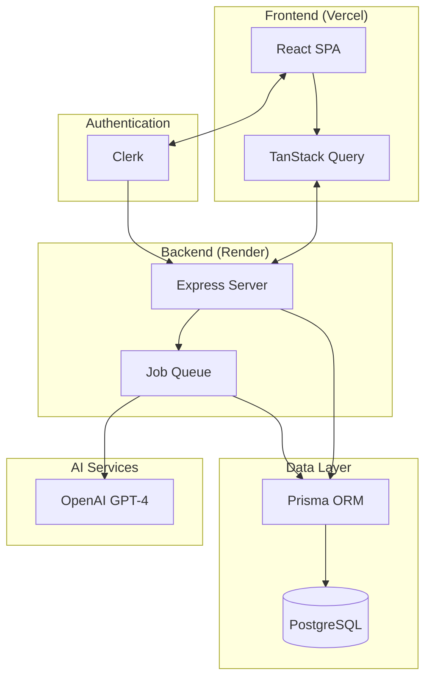

# Wryte AI

A production-grade SaaS platform for AI-powered content generation. Wryte AI enables marketing teams and content creators to generate SEO-optimized blog posts that align with their brand voice, streamlining the content creation pipeline from ideation to publication.

## The Problem

Content marketing teams face a persistent challenge: producing high-quality, SEO-optimized blog content at scale while maintaining brand consistency. Traditional approaches require significant time investment in research, writing, and optimization. Generic AI tools lack the contextual understanding of brand voice, target audience, and strategic keywords that make content effective.

## The Solution

Wryte AI provides an end-to-end content generation workflow:

1. **Configure** your organization's brand voice, target audience, and keyword strategy
2. **Generate** AI-powered blog titles scheduled to your content calendar
3. **Review** and approve structured outlines with SEO metadata
4. **Produce** full blog posts with consistent formatting and tone
5. **Export** content in multiple formats for your CMS

### Key Capabilities

- AI-powered title generation based on keyword strategy and posting schedule
- Structured outline creation with section headings, key points, and SEO metadata
- Full blog generation with consistent brand voice and formatting
- Content calendar with scheduling and status tracking
- Organization-based multi-tenant architecture
- Export to Markdown, HTML, or plain text

## Screenshots

### Landing Page


### Dashboard


### Content Calendar


### Title Management


### Blog Management


## Tech Stack

### Frontend

| Technology         | Purpose                                                                                                                                                           |
| ------------------ | ----------------------------------------------------------------------------------------------------------------------------------------------------------------- |
| **Vite + React**   | Build tooling and UI framework. Vite provides sub-second HMR and optimized production builds. React enables component-based architecture with a mature ecosystem. |
| **TypeScript**     | Static typing for compile-time error detection, improved refactoring confidence, and self-documenting code through type definitions.                              |
| **Tailwind CSS**   | Utility-first CSS framework eliminating context switching between markup and stylesheets. Produces minimal CSS bundles through purging.                           |
| **shadcn/ui**      | Accessible, composable component primitives built on Radix UI. Components are copied into the codebase for full customization control.                            |
| **TanStack Query** | Server state management with automatic caching, background refetching, and optimistic updates. Eliminates manual loading/error state management.                  |
| **React Router**   | Declarative routing with nested layouts, data loaders, and code splitting support.                                                                                |

### Backend

| Technology     | Purpose                                                                                                      |
| -------------- | ------------------------------------------------------------------------------------------------------------ |
| **Express**    | Minimal, unopinionated Node.js framework providing routing and middleware composition.                       |
| **Prisma**     | Type-safe ORM with auto-generated TypeScript types from the database schema, migrations, and query building. |
| **PostgreSQL** | ACID-compliant relational database with robust JSON support for flexible data modeling.                      |
| **OpenAI**     | GPT-4 integration for title generation, outline structuring, and full content creation.                      |

### Infrastructure

| Technology    | Purpose                                                                                                      |
| ------------- | ------------------------------------------------------------------------------------------------------------ |
| **Vercel**    | Frontend hosting with edge caching, automatic preview deployments, and zero-config CI/CD.                    |
| **Render**    | Backend hosting with managed PostgreSQL, automatic SSL, and horizontal scaling.                              |
| **Clerk**     | Authentication and user management with pre-built UI components, session handling, and organization support. |
| **New Relic** | Application performance monitoring, error tracking, and real user monitoring.                                |

## Architecture



### Architecture Overview

**Request Flow**: The React SPA communicates with the Express backend through TanStack Query, which handles caching and request deduplication. All API requests include a Clerk JWT for authentication.

**Authentication**: Clerk manages user sessions and organization membership. The backend validates JWTs on each request and enforces organization-level access control.

**AI Generation Pipeline**: Content generation requests create asynchronous jobs. The job queue processes requests against OpenAI's API, storing results in PostgreSQL. The frontend polls job status until completion.

**Separation of Concerns**: The frontend handles presentation and client-side state. The backend owns business logic, data persistence, and AI orchestration. This separation enables independent scaling and deployment.

## Project Structure

```
src/
├── components/           # Shared UI components
│   ├── ui/              # shadcn/ui primitives
│   ├── feedback/        # Loading states, error boundaries
│   └── data-table/      # Table components with sorting/filtering
├── features/            # Feature-based modules
│   ├── organization/    # Org management, settings
│   ├── titles/          # Title generation and management
│   ├── outlines/        # Outline creation and editing
│   ├── blogs/           # Blog generation and export
│   ├── jobs/            # Job status polling
│   └── settings/        # Content configuration
├── hooks/               # Shared React hooks
├── lib/                 # Utilities (API client, helpers)
├── pages/               # Route page components
├── routes/              # Route definitions and guards
├── config/              # Environment configuration
├── telemetry/           # Observability setup
└── test/                # Test utilities and setup
```

The feature-based structure groups related components, hooks, types, and API functions together. This colocation reduces cognitive overhead when working on a feature and makes dependencies explicit. Shared code lives in `components/`, `hooks/`, and `lib/`.

## Setup Instructions

### Prerequisites

- Node.js v18 or higher
- npm, pnpm, or yarn
- Access to a PostgreSQL database (local or hosted)
- Clerk account for authentication
- OpenAI API key for content generation

### Installation

```bash
# Clone the repository
git clone https://github.com/your-org/wryte-ai-web.git
cd wryte-ai-web

# Install dependencies
npm install

# Copy environment template
cp .env.example .env

# Start development server
npm run dev
```

### Environment Variables

| Variable                             | Required | Description                                                    |
| ------------------------------------ | -------- | -------------------------------------------------------------- |
| `VITE_API_URL`                       | Yes      | Backend API base URL (e.g., `https://api.wryte.ai/api/v1/`)    |
| `VITE_CLERK_PUBLISHABLE_KEY`         | Yes      | Clerk publishable key for authentication                       |
| `VITE_APP_ENV`                       | No       | Environment identifier: `development`, `staging`, `production` |
| `VITE_NEW_RELIC_BROWSER_LICENSE_KEY` | No       | New Relic browser agent license key                            |
| `VITE_NEW_RELIC_ACCOUNT_ID`          | No       | New Relic account identifier                                   |
| `VITE_NEW_RELIC_APPLICATION_ID`      | No       | New Relic application identifier                               |

For E2E testing:

| Variable                  | Required | Description                             |
| ------------------------- | -------- | --------------------------------------- |
| `E2E_CLERK_USER_USERNAME` | Yes      | Test user email for Playwright tests    |
| `E2E_CLERK_USER_PASSWORD` | Yes      | Test user password for Playwright tests |

## Running the Project

| Command                 | Description                            |
| ----------------------- | -------------------------------------- |
| `npm run dev`           | Start Vite development server with HMR |
| `npm run build`         | Type-check and build production bundle |
| `npm run preview`       | Preview production build locally       |
| `npm run lint`          | Run ESLint checks                      |
| `npm run lint:fix`      | Auto-fix ESLint issues                 |
| `npm run format`        | Format code with Prettier              |
| `npm run test`          | Run Vitest unit and integration tests  |
| `npm run test:coverage` | Run tests with coverage reporting      |
| `npm run test:e2e`      | Run Playwright end-to-end tests        |

## API Contract

The frontend communicates with the backend through a RESTful API. All endpoints require authentication via Clerk JWT.

### Organizations

| Method | Endpoint                     | Description                      |
| ------ | ---------------------------- | -------------------------------- |
| GET    | `/users/me/organizations`    | Get current user's organizations |
| GET    | `/organizations/{orgId}`     | Get organization by ID           |
| GET    | `/organizations/slug/{slug}` | Get organization by slug         |
| PUT    | `/organizations/{orgId}`     | Update organization              |

### Titles

| Method | Endpoint                             | Description                      |
| ------ | ------------------------------------ | -------------------------------- |
| GET    | `/titles/{organizationId}`           | List all titles for organization |
| GET    | `/calendar?orgId&year&month`         | Get titles for calendar view     |
| POST   | `/jobs/title/`                       | Create title generation job      |
| PUT    | `/titles/{organizationId}/{titleId}` | Update title                     |
| DELETE | `/titles/{organizationId}/{titleId}` | Delete title                     |

### Outlines

| Method | Endpoint                                 | Description                        |
| ------ | ---------------------------------------- | ---------------------------------- |
| GET    | `/outlines/{organizationId}`             | List all outlines for organization |
| POST   | `/jobs/outline/`                         | Create outline generation job      |
| PUT    | `/outlines/{organizationId}/{outlineId}` | Update outline                     |
| DELETE | `/outlines/{organizationId}/{outlineId}` | Delete outline                     |

### Blogs

| Method | Endpoint                           | Description                     |
| ------ | ---------------------------------- | ------------------------------- |
| GET    | `/blogs/{organizationId}`          | List all blogs for organization |
| POST   | `/jobs/blog/`                      | Create blog generation job      |
| PUT    | `/blogs/{organizationId}/{blogId}` | Update blog                     |
| DELETE | `/blogs/{organizationId}/{blogId}` | Delete blog                     |

### Jobs

| Method | Endpoint        | Description               |
| ------ | --------------- | ------------------------- |
| GET    | `/jobs/{jobId}` | Get job status and result |

### Settings

| Method | Endpoint                     | Description             |
| ------ | ---------------------------- | ----------------------- |
| GET    | `/settings/{organizationId}` | Get content settings    |
| PUT    | `/settings/{organizationId}` | Update content settings |

## Engineering Philosophy

### Feature-Based Architecture

Code is organized by feature rather than type. A feature module contains its components, hooks, API functions, and types. This reduces the mental overhead of navigating the codebase and makes feature boundaries explicit.

### Server State vs Client State

TanStack Query manages all server state (data fetched from the API). Local UI state uses React's useState and useReducer. This separation prevents the common pitfall of synchronizing server data in global state stores.

### Type Safety

TypeScript is configured in strict mode. API responses are typed through Zod schemas that validate at runtime and infer types at compile time. This catches contract mismatches between frontend and backend early.

### API Abstraction

All API calls go through a centralized axios client configured with authentication interceptors, error handling, and retry logic. Feature-specific API modules provide typed functions for each endpoint.

### Security Considerations

- Authentication tokens are managed by Clerk and attached via interceptors
- API responses are validated before use
- Environment variables are validated at startup
- Error boundaries prevent sensitive data leakage in error states

### Observability

- New Relic browser agent for real user monitoring
- Error boundary integration with error reporting
- Structured console logging in development
- Source maps generated for production debugging

## Testing Strategy

### Unit Tests (Vitest)

Component and hook tests using React Testing Library. Tests focus on user-visible behavior rather than implementation details. Coverage thresholds enforce minimum test coverage.

### Integration Tests (Vitest)

API module tests with mocked HTTP responses. Verify correct request formation and response handling.

### End-to-End Tests (Playwright)

Full user flow tests against a running application. Cover critical paths: authentication, title generation, outline approval, blog export.

## Future Enhancements

- **CMS Integrations**: Direct publishing to WordPress, Ghost, and Contentful
- **Team Collaboration**: Comments, review workflows, and approval chains
- **AI Personalization**: Fine-tuned models trained on approved content
- **Analytics Dashboard**: Content performance metrics and SEO tracking
- **Queue-Based Processing**: Redis-backed job queue for improved reliability
- **Webhook Notifications**: External system integration for job completion events
- **Multi-Language Support**: Content generation in additional languages
- **Template Library**: Reusable content structures and formatting presets

## License

MIT License. See [LICENSE](LICENSE) for details.
